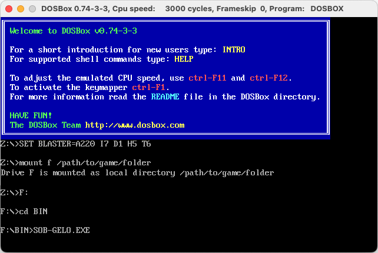
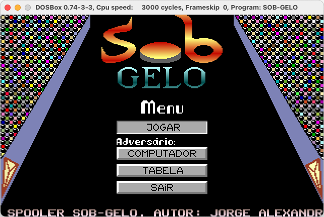

# Air-hockey (Sob-Gelo)

An arcade-style game that I wrote a few decades ago. Read further if you want to know the whole story.

Some remarks:

* The code is overly commented (because it had to be - read below)
* I have done some code linting before publishing but mostly convert the code page. This is still the original code.

## Folders

* bin - the executable game (including images and scores file)
* docs - Spooler Magazine article (in portuguese)
* img - game screenshots
* original - original source code (as it was published) - don't look at this, the formatting sucks
* src - the linted code
* tools - some tools used to clean up the code

## DOS Emulator

To run this application using [Dosbox](https://www.dosbox.com/) do:

```bash
Z:\>mount f /path/to/game/folder

Z:\>F:
F:\>cd BIN
F:\>SOB-GELO.EXE
```



## Playing the Game

There are 3 game modes:

1. Single player against the PC
2. Two players on the same PC
3. Two players on two PCs (connected via serial RS232)

For the third mode, Dosbox won't help much. You would need two very old personal computers running MS-DOS and an RS232 cable. Yeah, right.



## The Story

This was a school project around 1991-92. The code is heavily commented because that was required for the grading.

Later, I have decided to publish the code in Spooler - a hobbyist PC magazine that was very popular in Portugal at that time. After a few letters back and forth with the magazine, the game was ready to be published. This is the version that has been published.

## License

Released under the [MIT License](http://www.opensource.org/licenses/MIT).
